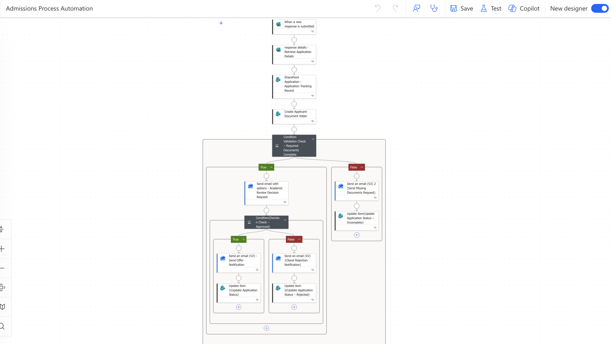
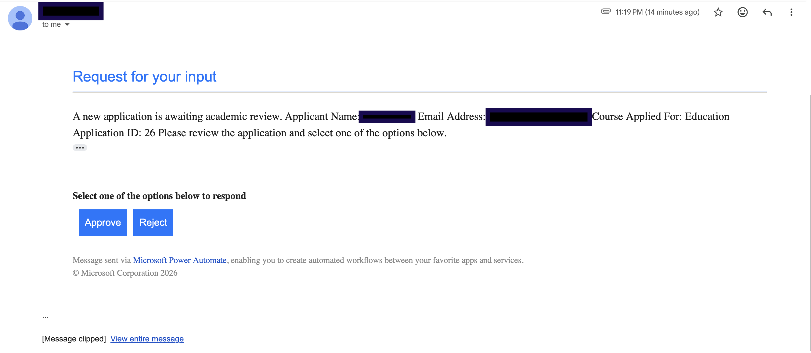
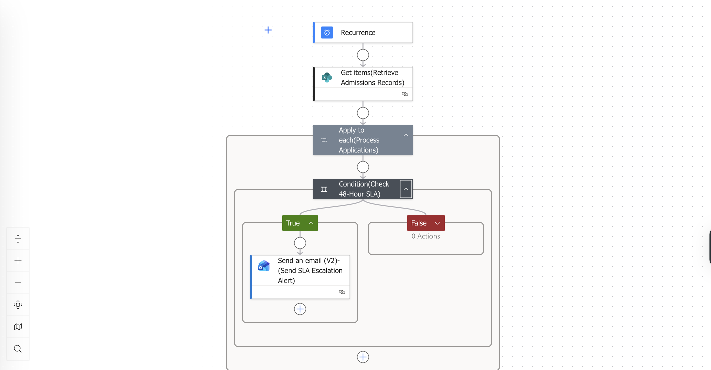

# 🎓 Admissions Process Automation Solution

End-to-end admissions workflow automation using Microsoft Power Platform and Microsoft 365.

---

## 📌 Overview

This project demonstrates an automated admissions workflow built using:

- Microsoft Forms
- Power Automate
- SharePoint
- Outlook
- Microsoft 365

---

## 🚨 Business Challenge

The existing admissions process relied heavily on manual activities:

- Applications arrived via email
- Documents arrived separately
- Manual completeness checks
- Manual academic review routing
- Inconsistent tracking

---

## ✅ Key Features

- Automated application intake
- Document validation
- Academic approval workflow
- Applicant notifications
- SharePoint tracking
- SLA monitoring

---

## 🏗 Solution Architecture

| Component | Purpose |
|------------|----------|
| Microsoft Forms | Applicant data capture |
| Power Automate | Workflow automation |
| SharePoint | Case management |
| Outlook | Notifications |
| Scheduled Flow | SLA monitoring |

---

## 📸 Screenshots

### Main Workflow

### Approval Email

### SharePoint Tracking

### SLA Monitoring

---

## 📈 Business Benefits

- Reduced manual effort
- Faster processing
- Better visibility
- Improved applicant experience
- Stronger governance

---
 
## 👤 Author
K.A
MSc Data Science & Business Analytics
Power Platform | Data Analytics | Process Improvement | Business Analysis

